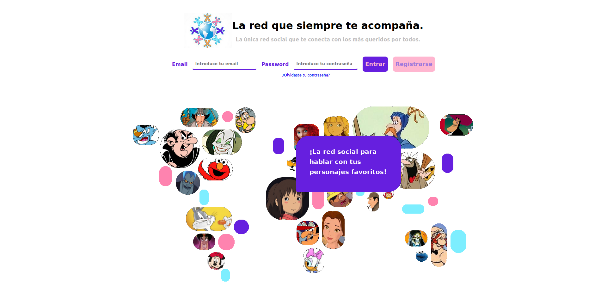
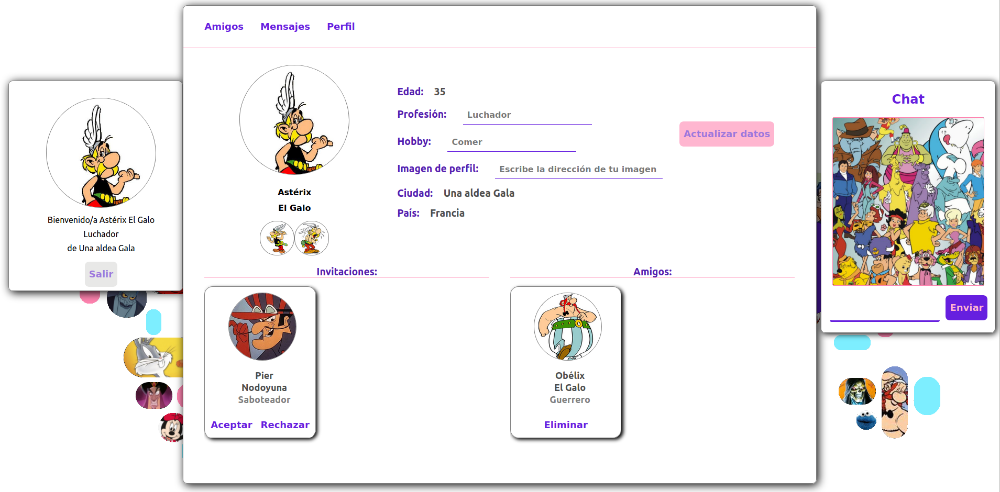
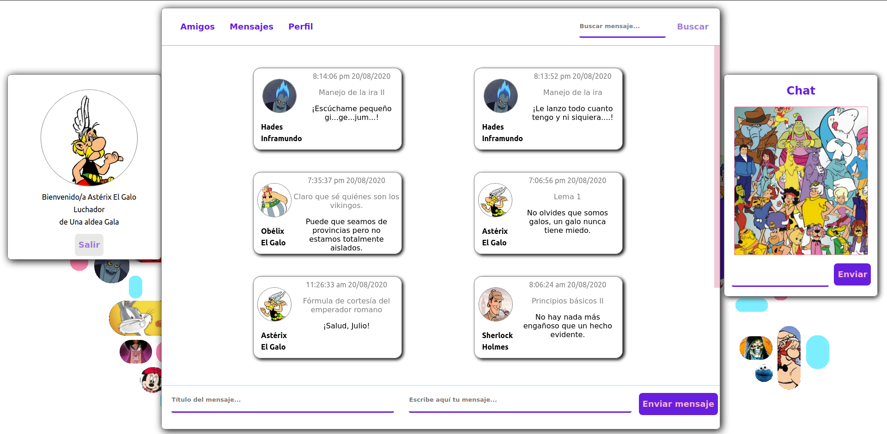

# SociaNetwork App
An application for being connected with those you always loved.
<br>

## 1. Technologies
This is a project to learn how to work with:
* React, 
* Redux, 
* NodeJs,
* Mongo and 
* Mongoose. 

Please feel free to explore my code. I welcome any suggestion or comment to improve it.

Here you can find some screenshots of the app running:

 
 
 

<br>

## 2. Installation

This is one of the two parts of the application, be sure you have cloned both (back and front) or it won't run succesfully.

First of all, open a terminal and clone the repository in the desired directory:
```
$ git clone https://github.com/Adrian-M-A/SocialNetworkFront

```
IMPORTANT: It's necessary to run the backend before next commands. Please check if it is running.

Second, enter in the front folder, open a terminal, install all the dependencies and run the frontend:
```
$ npm i
$ npm start
```
<br>

## 3. Management

A window will pop up in your navigator and you will have direct access to the app. We hope you enjoy your visit.

<br>

## 4. Copyright and license

Under GNU-GPL3 license. For more information check out the 
LICENSE file.

<br>

## 5. Contact information and credits

Author: Adrián M.A.

Contact: adrian@neurocadi.es 
  
<br>


